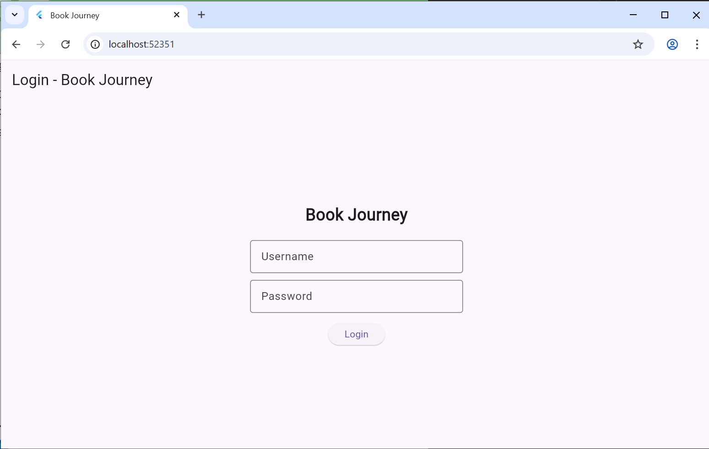
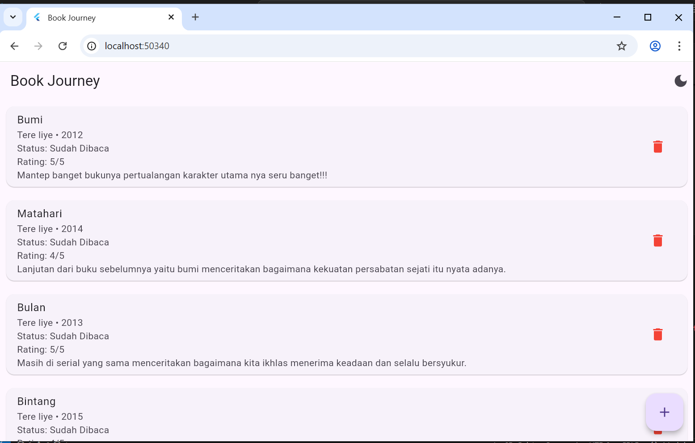
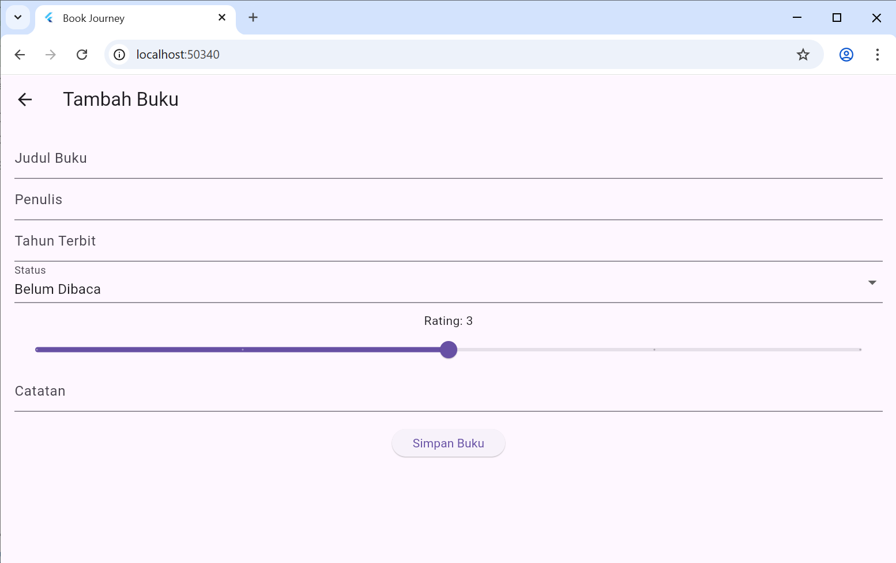
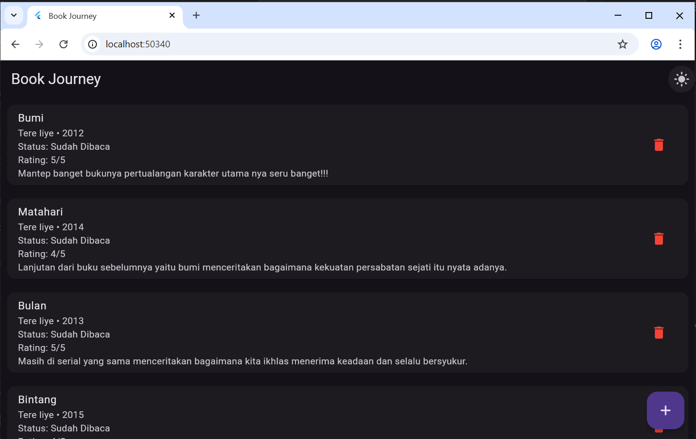

# Book Journey – Flutter Book Tracker App

## Anggota kelompok

**Nama:** Muhammad Ibrah Adz-dzikra
**NIM:** 2310120010


## Deskripsi Aplikasi

**Book Journey** adalah aplikasi Flutter berbasis web yang digunakan untuk mencatat, mengelola, dan memantau progres membaca buku. Aplikasi ini memungkinkan pengguna untuk menambahkan buku, memberikan rating, menulis catatan, serta mengatur status baca buku dengan tampilan sederhana dan modern yang mendukung light dan dark mode.

Aplikasi ini dikembangkan menggunakan:

* Flutter (Web)
* SQLite untuk penyimpanan data utama
* SharedPreferences untuk menyimpan data terakhir
* List In-Memory untuk menampilkan data pada UI

---

## Fitur Utama

### 1. Login Page

Login bersifat sederhana sebagai simulasi autentikasi pengguna.

* Menggunakan form username dan password
* Validasi input tidak boleh kosong
* Jika login berhasil, pengguna diarahkan ke halaman utama (Home Page)

---

### 2. Light / Dark Mode

Aplikasi mendukung perubahan tema secara dinamis:

* Tombol switch tersedia di halaman utama
* Perubahan tema langsung diterapkan ke seluruh aplikasi
* Preferensi tema disimpan agar konsisten saat aplikasi dibuka kembali

---

### 3. CRUD Data dengan SQLite

Data buku disimpan menggunakan database lokal SQLite dengan operasi:

* **Create** : Menambahkan buku baru
* **Read** : Menampilkan daftar buku
* **Update** : Mengubah data buku
* **Delete** : Menghapus buku

Struktur data buku meliputi:

* Judul Buku
* Penulis
* Tahun Terbit
* Status (Belum Dibaca / Sedang Dibaca / Selesai)
* Rating (1–5)
* Catatan

---

### 4. SharedPreferences

Digunakan untuk menyimpan:

* Data buku terakhir yang dibuka / ditambahkan
* Tema terakhir (Light / Dark)

Saat aplikasi dibuka kembali, data ini otomatis ditampilkan kembali kepada pengguna.

---

### 5. List In-Memory

Data dari SQLite dimuat ke dalam List di memori untuk keperluan UI agar:

* Tampilan lebih responsif
* Mudah dikelola saat update atau delete

List ini digunakan untuk menampilkan seluruh buku pada halaman Home.

---

## Alur Penggunaan Aplikasi

1. User membuka aplikasi
2. Melakukan login
3. Masuk ke halaman Home
4. Menambah buku melalui halaman Tambah Buku
5. Data tersimpan ke SQLite
6. Buku tampil di daftar
7. User dapat mengedit atau menghapus buku
8. Tema dapat diubah kapan saja
9. Data terakhir otomatis tersimpan

---

## Screenshot Aplikasi

(Sisipkan minimal 5 screenshot berikut)

1. ✅ Halaman Login

2. ✅ Halaman Home

3. ✅ Halaman Tambah Buku

4. ✅ Mode Light

5. ✅ Mode Dark / Setelah tema diubah



## Struktur Folder Proyek

```
book_journey/
│
├── lib/
│   ├── pages/
│   ├── models/
│   ├── database/
│   └── main.dart
│
├── screenshots/
├── pubspec.yaml
└── README.md
```